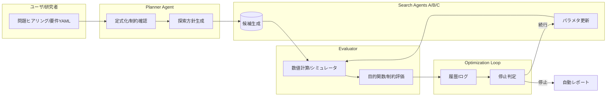

# LLM駆動最適化フレームワーク — 現実路線プロジェクト計画書 v1.0

---

## 1. 背景と狙い（要約）
- **何を作る？**  
  LLM（大規模言語モデル）をプランナーとして活用し、探索（A/B/Cのロール）、評価（数値計算）を束ねる**汎用最適化ループ**。
- **なぜ今？**  
  探索空間の設計や評価ロジックの文章化・自動化が進み、**人手の反復作業を大幅削減**できる。量子系（例：qGANのKL最適化）にも一般化可能。
- **最初の適用例（例）**  
  qGANのKL発散 \(D_\mathrm{KL}(p_\text{data} \parallel p_\text{qGAN})\) の最小化を主目的に、**回路深さ・パラメータ数・測定ショット**などを副目的として**多目的最適化**。

---

## 2. 成果物（Deliverables）
1. **最小MVP**（2週間）
   - 1つの最適化問題を**スクリプト1本**で回せるCLI（YAML設定読み込み）
   - 探索→評価→次点生成の**自動ループ**（Optuna/NEVERGRADいずれかまたは両方）
   - ログ・指標（CSV）と**自動レポート（Markdown/HTML）**
2. **拡張版**（追加4〜8週間）
   - **エージェント3役（Planner / Searchers A,B/C / Evaluator）**の差し替え運用
   - **多目的**（HV: Hypervolume）と**制約**のサポート
   - 可視化ダッシュボード（Weights & Biases / MLflow など。学内PCならPlotly Dash）
   - **進捗メモ**：評価器インターフェースと qGAN KL アナリティック評価器の試作版に加え、LLM プランナー向けのアダプタ層と Usage ログ基盤を整備済み
3. **ドキュメント一式**
   - 30分クイックスタート、オンボーディング手順、SOP（実験運用手順）
   - 「途中参加者用」読み進めガイド（本書）

**非目標（当面）**
- 実機量子計算機（QPU）の安定運用（シミュレータ基盤で十分に検証した後に検討）
- LLMのみで完全自律的な問題定式化（初期は人間レビュー必須）

---

## 3. スコープと現実的制約
- **スコープ内**：単目的/多目的の連続・離散最適化、量子回路パラメタの調整、メタヒューリスティクス（GA, CMA-ES 等）、ベイズ最適化（Optuna）
- **スコープ外（初期）**：超大規模分散（100+ノード）、バッチ単価が高い商用LLMの常時接続、閉域ネットワークしか使えない環境
- **前提**：ローカルGPU（例：RTX 3090）または学内計算機、もしくは低額クラウドをスポット利用

---

## 4. 体制・役割（RACI）
- **R（Responsible）実装担当**：メイン開発者（あなた）
- **A（Accountable）意思決定**：指導教員 or プロジェクトリード
- **C（Consulted）助言**：ラボメンバー、量子・最適化の有識者
- **I（Informed）共有**：共同研究者、学内レビュー担当

> 小規模チーム想定：2〜3人（実装×1、数値評価×1、レビュー×1）

---

## 5. アーキテクチャ概要


**技術選定（現実的候補）**
- 言語：Python 3.11
- 最適化：Optuna / Nevergrad / CMA-ES（pycma）
- エージェント実装：軽量なら**自前クラス**、将来拡張でLangGraph/AutoGen
- 量子シミュレーション：PennyLane or Qiskit（qGAN系はPennyLaneが扱いやすい）
- 可視化・追跡：MLflow or Weights & Biases（学内ではMLflowローカル）
- 依存管理：Poetry or uv、Dockerは配布用

---

## 6. ディレクトリ設計（例）
```
Anemoi(root)/
├── README.md
├── pyproject.toml  # Poetry/uv
├── src/
│   ├── core/          # ループ/共通I/F
│   ├── agents/        # planner.py, search_a.py, ...
│   ├── evaluators/    # qgan_kl.py など問題別
│   ├── utils/         # ロガー、可視化
│   └── cli.py         # エントリポイント
├── configs/
│   ├── qgan_kl.yaml   # 実験用設定ファイル
│   └── optuna.yaml    # 探索器の設定
├── runs/              # ログ/成果物
└── reports/           # 自動生成レポート
```

---

## 7. MVP要件（2週間）
**機能**
- `configs/*.yaml` を読み、**単目的**の探索ループを自動実行
- 評価関数は**ユーザ定義のPython関数**を呼び出し（例：qGAN KL）
- 早期停止（評価回数、改善閾値、時間）
- ログ（CSV）と最良解のYAML/JSON出力、最終にMarkdownレポートを生成

**完了の定義（DoD）**
- 任意の連続パラメタ最適化が**再現可能**に1コマンドで走る
- READMEの手順で**30分以内に初回実行**が成功

---

## 8. ロードマップ（現実的な時間見積）
- **Week 1**：CLI骨格、設定YAML→ループ実行、ダミー評価関数
- **Week 2**：実データの評価関数（qGAN KL）実装、CSVログ＆レポート
- **Week 3-4**：多目的（HV）対応、可視化、Optuna/NEVERGRAD切替
- **Week 5-6**：エージェント分離（Planner / A/B/C / Evaluator）、差し替えI/F確立
- **Week 7**：SOP整備、オンボーディング、事例（qGAN）公開
- **Week 8**：バグ修正・安定化、βリリース

> 人数：1〜2名想定。授業・研究並行でも**8週間**で現実的。

---

## 9. コスト設計（現実的レンジ）
**初期投資（0〜3万円）**
- 基本は**手持ちPC/GPUで0円**。必要に応じてSSD増設や外付けストレージ。

**運用コスト（月）**
- LLM API：\( \text{トークン/回} \times \text{回数} \times \text{単価} \)  
  例：1回あたり5kトークン×500回×（**ここを変更：使用モデルの単価**）
- GPUクラウド：\( \text{GPU時間} \times \text{時間単価} \)  
  例：g5/g6クラスを数十時間→**数千〜数万円**程度（相場は各自のアカウントで要確認）
- 可視化・追跡（MLflow/W&B）：無料枠〜学術プラン

**節約策**
- **LLMはプロンプト圧縮**・バッチ化・キャッシュ
- 量子回路は**小規模で妥当性確認→段階的拡大**
- ローカルで事前検証→クラウドは**短時間スポット**

---

## 10. 実験運用SOP（標準手順）
1. `configs/xxx.yaml` を作成  
   - 問題名、パラメタ範囲、目的関数、制約、評価回数、停止条件
2. `src/anemoi/evaluators/xxx.py` に評価器クラス/ファクトリを実装
   - I/F: `BaseEvaluator.evaluate(params, seed) -> dict(metrics)` または `create_evaluator(config)` ファクトリ
3. CLI実行：`python -m anemoi.cli --config configs/xxx.yaml`
4. 実行後、`runs/exp001/` に**ログと最良解**が保存
5. `reports/exp001.md` が自動生成 → Gitでコミット
6. 改善が鈍化したら、Plannerが**探索器の切替/範囲再設計**を提案→再実行

**テンプレ（YAML例）**
```yaml
# configs/qgan_kl.yaml
problem: qgan_kl
seed: 42
n_trials: 200
searcher: optuna  # {optuna, nevergrad, cmaes}
params:
  n_qubits: {min: 3, max: 6, step: 1}
  depth:    {min: 1, max: 6, step: 1}
  lr:       {min: 1e-4, max: 5e-2, log: true}
constraints:
  max_depth: 6
  max_params: 256
objective:
  primary: kl   # 目的（最小化）
  secondary: [depth, params]  # 多目的
stopping:
  time_limit_min: 60
  no_improve_patience: 20
report:
  metrics: [kl, depth, params, shots]
```

---

## 11. 評価設計（指標/統計）
- **単目的**：最良値、中央値、四分位、再現率（独立試行k回）
- **多目的**：**Hypervolume (HV)**、フロントの点数、分布の均一性
- **安定性**：乱数シード差分のばらつき、**効果量**（Cliff’s delta など）
- **再現性**：`
  pip freeze` 保存、config・コード・データの**三点固定**

---

## 12. qGAN KL 具体化（例）
**目的関数（主）**
\[
  \min_\theta \ D_\mathrm{KL}\big(p_\text{data}(x) \parallel p_\text{qGAN}(x;\theta)\big)
\]

**副目的（例）**
- 回路深さ \(d\)（小さいほど良い）
- パラメタ数 \(|\theta|\)（小さいほど良い）
- 測定ショット数（コスト最小化）

**制約（例）**
- \(n_\text{qubits} \leq 6\)、\(d \leq 6\)

**実装のヒント**
- **シミュレータ優先**（statevector→noise model）
- Ansatz：RealAmplitudes / HardwareEfficient を深さ可変で
- 最適化：外側はOptuna、内側はAdam/COBYLA等の混合も可

---

## 13. リスクと軽減策
- **過学習/リーク**：評価データ分割、早期停止、正則化
- **LLMの幻覚**：Plannerの提案は**人間が最終承認**
- **コスト膨張**：LLM呼び出しの**回数上限**、キャッシュ必須
- **再現不能**：シード固定・環境固定・データ版管理（DVC推奨）
- **量子特有**：ノイズの過小評価→**ノイズモデル**を必ず併用

---

## 14. 途中参加者向け：30分クイックスタート
1. **環境構築（10分）**
   - Python 3.11、`uv` or `poetry` をインストール
   - `uv sync` / `poetry install`
2. **最初の実行（5分）**
   - `configs/qgan_kl.yaml` をコピー→`my_trial.yaml` に変更
   - 「ここを変更」項目（回数・時間制限）を小さく設定
3. **評価関数を読む（10分）**
   - `src/evaluators/qgan_kl.py` の`evaluate()`の入出力を確認
4. **結果を確認（5分）**
   - `runs/exp001/` のCSVと`reports/exp001.md`を開く

---

## 15. 今後検討すべき事項（チェックリスト）
- [ ] Plannerの**プロンプトテンプレ**標準化（目的・制約・データ概要）
- [ ] 多目的HVの**正規化戦略**（KL/深さ/パラメタを無次元化）
- [ ] **ノイズモデル**の標準セット（depolarizing, readout）
- [ ] **クラウド/学内計算機**のキュー運用ルール
- [ ] 研究倫理・データ管理（学内規程の遵守）
- [ ] 成果の**再実験手順**と公開パッケージ化

---

## 16. 疑似コード（最小ループ）
```python
# src/core/loop.py（概略）
for trial in searcher.ask(n_trials):
    params = planner.propose(trial)  # LLM or 手続き
    metrics = evaluator.evaluate(params, seed=trial)
    searcher.tell(trial, metrics)
    logger.log(trial, params, metrics)
    if stopper.should_stop():
        break
report.generate(run_dir)
```

---

## 17. 用語集（抜粋）
- **Planner**：問題定式化や探索方針を支援（LLM）
- **Search Agent**：候補を生成する探索器（Optuna/NEVERGRAD/CMA-ESなど）
- **Evaluator**：候補を数値計算で採点（qGAN KL など）
- **HV**（Hypervolume）：多目的フロントの指標（大きいほど良い）

---

## 18. 次の一歩（アクション）
1. MVPブランチを作成し、`configs/qgan_kl.yaml` を最小実験サイズで確定
2. `evaluate()`のI/Fを固定→ダミー戻り値→本実装
3. ログ→レポート生成の自動化（Markdown→HTML）
4. Week 2末までに**最初の再現可能結果**をコミット

---

### 付録A：Optuna設定スニペット（例）
```yaml
# configs/optuna.yaml
sampler: tpe
pruner: median
study_name: qgan_kl_v1
storage: sqlite:///runs/optuna.db  # ここを変更: 保存先
```

### 付録B：レポートの目次（自動）
- 実験条件（Gitハッシュ・ライブラリ）
- 最良解とパラメタ
- 収束曲線（平均・中央値）
- 多目的フロントとHV
- 考察メモ（テンプレを自動出力）

---

> 本計画書は、初期メモの**「プランナー/探索/評価」「処理手順」**を踏まえ、**フェーズ別に現実的な実装・費用・時間**を具体化したものです。必要に応じて学内リソース・クラウド価格・使用LLMの単価を差し替えて運用してください。

